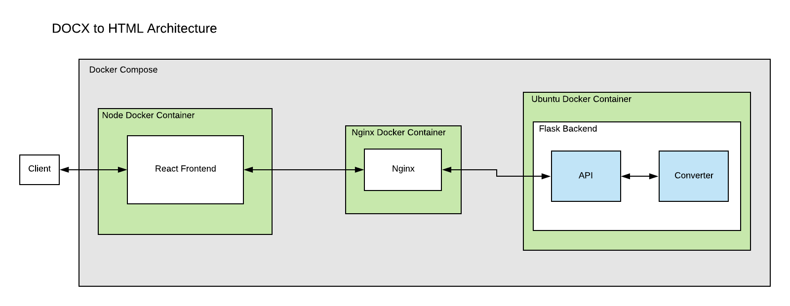
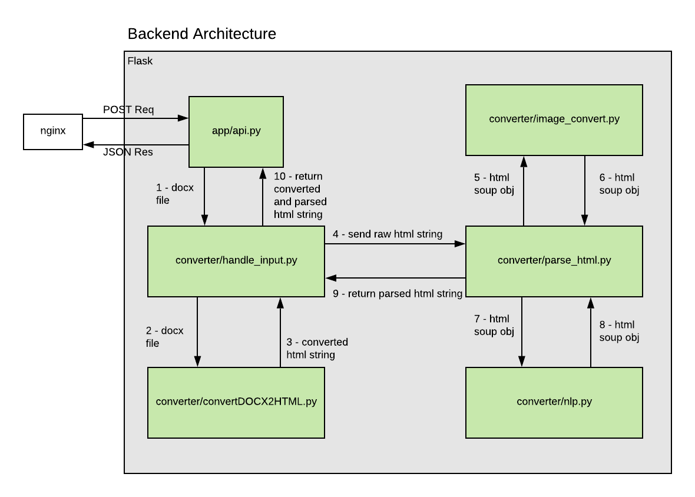

# DOCX to HTML

This project takes a DOCX file and converts it to HTML. 

## Getting Started

Everything is self contained in the docker containers and connected using docker-compose. All dependencies are installed by docker and self contained so all you need to do is download the app, build it and run it.

### Prerequisites

You need to have docker installed on your machine. 

```
https://docs.docker.com/install/
```

## Deployment and Development - Download the app, build it and run it

Download the app:

```
git clone https://podaac-git.jpl.nasa.gov:8443/ajoseph/docx-to-podaac-html
```

### For development - build the docker containers using docker-compose:

Install the node modules in the dev build
```
cd frontend && npm install 
```

```
cd docx-to-podaac-html && docker-compose up -d --build
```

This command builds each docker container and installs all of the dependencies needed. It also runs the app as a daemon using -d, this allows you to exit your terminal session and continue to run the app. 

The Frontend is exposed on **port 8083**. To access the app locally, go to http://localhost:8083/

In production, point to port 8083 or change the exposed port in [docker-compose.yml](docker-compose.yml) and [frontend/prod.docx2html-react-frontend.Dockerfile](frontend/prod.docx2html-react-frontend.Dockerfile).

To kill the app:

```
docker-compose down
```

To run the app without building again:
```
docker-compose up -d
```

### Deployment for production

Uses [prod.docker-compose.yml](prod.docker-compose.yml) file and the production dockerfiles for each container.

```
docker-compose -f docker-compose.yml -f prod.docker-compose.yml up -d --build
```

In production, point to port 8083 or change the exposed port in the [prod.docker-compose.yml](prod.docker-compose.yml) file and [frontend/prod.docx2html-react-frontend.Dockerfile](frontend/prod.docx2html-react-frontend.Dockerfile).

If you need to change ports here is a list of where those files live:

* [Change fetch POST request in frontend MainContent.js](frontend/src/components/MainContent.js)
* [Dev Frontend Dockerfile](frontend/dev.docx2html-react-frontend.Dockerfile)
* [Prod Frontend Dockerfile](frontend/prod.docx2html-react-frontend.Dockerfile)
* [Dev Backend Dockerfile](backend/dev.docx2html-flask-backend.Dockerfile)
* [Backend app.ini](backend/app.ini)
* [Dev Nginx Conf](nginx/dev.nginx.conf)
* [Prod Nginx Conf](nginx/prod.nginx.conf)
* [Prod Backend Dockerfile](backend/prod.docx2html-flask-backend.Dockerfile)
* [Dev Docker Compose File](docker-compose.yml)
* [Prod Docker Compose File](prod.docker-compose.yml)

## Built With

### Web Frameworks 

* [React](https://reactjs.org/) - Frontend
* [Flask](https://flask.palletsprojects.com/en/1.1.x/) - Backend


### Docker Images:

* [Node](https://hub.docker.com/_/node/) - Frontend
* [Ubuntu](https://hub.docker.com/_/ubuntu) - Backend
* [Nginx](https://hub.docker.com/_/nginx) - Reverse Proxy Server

### Dependencies

* [Frontend npm installs](frontend/package.json)
* [Backend pip installs](backend/requirements.txt)
* [Frontend Node Docker Image](/frontend/dev.docx2html-react-frontend.Dockerfile)
* [Backend Ubuntu Docker Image](/backend/dev.docx2html-flask-backend.Dockerfile)
* [Nginx Docker Image](/nginx/dev.docx2html-nginx.Dockerfile)

### End to End App Workflow




The user uplodas a file or multiple files on the frontend. React uses Fetch for a POST request to the Flask Backend. The request gets handled in app/api.py. It saves the .docx file to the server in /backend/ and sends the file to converter/handle_input.py.

converter/convertDOCX2HTML.py converts the file to an HTML string, deletes the .docx file and returns the HTML string.

converter/parse_html.py is where all of the parsing and HTML manipulation takes place. It converts the HTML to a Beautiful Soup Object and parses it.

If there are .tiff, .emf or .wmf images, they get converted to PNG in converter/image_converter.py. They get saved as a tmp file while being converted and all the tmp files get deleted once the conversion is over.

converter/handle_input.py returns the parsed HTML to app/api.py to be returned as JSON to the frontend.

The frontend saves the HTML as a file to the users computer.

All containers are set to always be restarted. No data is being saved.

In the dev environment the files are linked to the container using 'volumes' so you do not have to rebuild the container if changes are made. The React frontend hot reloads so you don't need to restart the server. If you change anything in the Flask backend, you need to reboot the server to see any changes.

In the production environment 'volumes' are removed for security purposes.

## Authors

* **Andrew Joseph** - *Initial work* 

## License

This project is licensed under the TODO - see the [LICENSE.md](LICENSE.md) file for details

## Acknowledgments

*  *JPL Mentors:* David Moroni & Suresh Vannan
